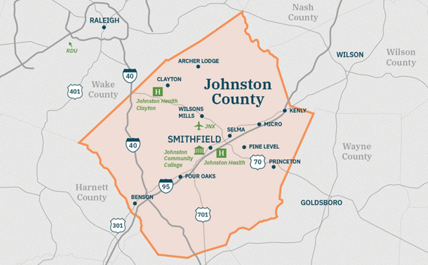

# Utilizing the Clay Foundation Model and Sentinel-2 Imagery for Urban Growth Monitoring in Johnston County, North Carolina

Benton Tripp

## Introduction

Urbanization is a transformative process that reshapes landscapes, alters ecosystems, 
and influences socio-economic dynamics. Monitoring urban growth is essential for sustainable 
urban planning, environmental conservation, and resource management. Remote sensing technologies, 
particularly satellite imagery, offer valuable tools for observing and analyzing urban expansion 
over large areas and time periods. The Sentinel-2 satellite mission provides high-resolution, 
multispectral imagery that is instrumental in land cover and land use studies.

Advancements in machine learning have enhanced the capacity to process and interpret vast amounts 
of remote sensing data. The Clay Foundation Model, an open-source artificial intelligence model 
for Earth observation, leverages self-supervised learning and Vision Transformer architectures to 
generate embeddings representing spatial and temporal features of the Earth's surface. These 
embeddings can be utilized for various downstream tasks, including classification, regression, 
and change detection.

This project aims to develop a proof-of-concept for monitoring urban growth in Johnston County, 
North Carolina. By integrating Sentinel-2 imagery with the Clay Foundation Model, the study seeks 
to analyze urban expansion patterns and assess the effectiveness of different modeling approaches.

## Objective

The primary objective is to utilize the Clay Foundation Model and Sentinel-2 imagery to monitor 
and analyze urban growth in Johnston County, North Carolina.

The project will:

- Develop a methodology for processing and integrating Sentinel-2 imagery with urban density data.
- Generate embeddings using the Clay Foundation Model to capture spatial features.
- Explore modeling approaches such as regression, classification, and binning to predict urban 
  density percentages.
- Determine the most effective method through testing and evaluation.
- Provide insights into urban growth patterns within the study area.

## Study Site

Johnston County is located in the eastern part of North Carolina, United States, covering 
approximately 2,050 square kilometers. It lies between latitudes 35.3°N to 35.8°N and 
longitudes 78.0°W to 78.6°W. The county is part of the rapidly expanding Raleigh-Durham-Chapel 
Hill metropolitan area, making it a pertinent case study for urban growth analysis.

Coordinates are defined in the North Carolina State Plane Coordinate System (NAD83), with 
units in meters. This coordinate system ensures spatial accuracy and consistency in measurements 
across the study area.

*Figure 1: Johnston County, North Carolina (obtained from [Johnston County Economic Development](https://www.growwithjoco.com/why-joco/towns/))*

## Data

### Johnston County GIS Data

- **Description**: Provides the official county boundary for spatial extent definition.
- **Source**: [Johnston County GIS Data (county boundary)](https://www.johnstonnc.com/gis2/content.cfm?PD=data)

### Sentinel-2 Satellite Imagery

- **Description**: Multispectral imagery with 10-meter spatial resolution.
- **Features**:
  - High temporal resolution with revisit times of approximately five days.
  - Includes 13 spectral bands suitable for land cover analysis.
- **Access Methods**:
  - Accessed via the `pystac_client` library from:
    - [Microsoft Planetary Computer STAC API](https://planetarycomputer.microsoft.com/api/stac/v1/)
    - [Earth Search AWS STAC API](https://earth-search.aws.element84.com/v1)

### Urban Density Raster Data

- **Description**: Raster datasets indicating urban impervious surfaces to generate labels.
- **Potential Sources**:
  - **National Land Cover Database (NLCD)**: Provides 30-meter resolution data on land 
    cover and imperviousness.
    - [NLCD Data](https://www.mrlc.gov/data)
- **Usage**: Used to calculate urban density percentages within spatial patches.

## Methods and Tools

### Data Processing

1. **Data Acquisition**:
   - Obtain Sentinel-2 imagery covering Johnston County for the selected dates.
   - Acquire urban density raster data corresponding to the same period.

2. **Preprocessing**:
   - **Coordinate Alignment**: Ensure all datasets are in the NAD83 coordinate system.
   - **Cloud Masking**: Apply cloud masks to Sentinel-2 imagery to remove cloud-covered areas.
   - **Resampling**:
     - Resample urban density data to 10-meter resolution to match Sentinel-2 imagery.
     - Aggregate data into 600x600-meter patches, equivalent to 60x60 pixels.
   - **Label Generation**:
     - Calculate the proportion of urban area within each patch.
     - Labels may represent continuous percentages or be categorized for classification tasks.

3. **Embedding Generation**:
   - Use the Clay Foundation Model to generate embeddings from the Sentinel-2 image patches.
   - The model leverages self-supervised learning with Masked Autoencoder (MAE) methods.

### Modeling Approaches

The project will explore different modeling approaches to predict urban density using embeddings generated 
from the Clay Foundation Model. Initially, potential methods include regression, classification, and binning 
techniques. Regression involves predicting the percentage of urban area within each patch as a continuous variable, 
capturing nuanced variations in urban density. Classification simplifies the problem by categorizing patches as 
urban or non-urban based on a defined threshold, which may overlook subtle differences but reduces complexity. 
Binning offers a balance by grouping urban percentages into categories such as low, medium, and high density, 
providing more detail than binary classification while maintaining manageable complexity.

The selection of the most appropriate modeling approach will be determined after a thorough exploration of 
the data, its distribution, and the capabilities of the Clay model framework. This preliminary analysis will 
inform the decision, allowing for the alignment of the modeling technique with the data characteristics and 
project objectives. Performance metrics and feasibility considerations will guide the choice without 
necessarily testing all methods extensively.

### Tools and Software

- **Programming Language**:
  - **Python**: Selected for its versatility and extensive libraries.

- **Data Processing Libraries**:
  - `geopandas`, `rasterio`, `xarray`, `rioxarray`: For spatial data handling.
  - `numpy`: For numerical computations.

- **Machine Learning Libraries**:
  - `torch` (PyTorch): For utilizing the Clay Foundation Model.
  - `scikit-learn`: For implementing machine learning algorithms.

- **Clay Foundation Model**: 
  - Accessed via the Hugging Face repository [made-with-clay/Clay](https://huggingface.co/made-with-clay/Clay) 
    for processing Earth observation data.

- **Satellite Data Access**:
  - `pystac_client`: For accessing Sentinel-2 imagery through STAC APIs.

- **Visualization**:
  - `matplotlib`: For data visualization and plotting.

## Expected Results

The anticipated outcome of this project is the development of a model capable of predicting urban 
density in Johnston County using Sentinel-2 imagery and embeddings from the Clay Foundation Model. 
By employing the selected modeling approach, the study aims to generate detailed maps illustrating 
the distribution of urban density across the county. These visualizations are expected to reveal 
patterns of urban growth and identify areas experiencing significant development.

Methodologically, the project intends to demonstrate the applicability of the Clay Foundation Model 
in the context of urban growth monitoring. By providing a framework that integrates advanced machine 
learning techniques with remote sensing data, the study may offer valuable insights for future research 
in similar domains. Additionally, the project will address challenges encountered during the process, 
such as data resolution discrepancies and temporal alignment issues, and will suggest strategies for
improving accuracy and extending the methodology in subsequent studies.

## References

1. Clay Foundation. (2023). *Clay Foundation Model: An Open Source AI Model for Earth*. 
   Retrieved from [https://www.clay.earth](https://www.clay.earth)

2. He, K., Chen, X., Xie, S., Li, Y., Dollár, P., & Girshick, R. (2022).
   "Masked Autoencoders Are Scalable Vision Learners."
   *Proceedings of the IEEE/CVF Conference on Computer Vision and Pattern Recognition*, 16000-16009.
   doi:10.1109/CVPR52688.2022.01556

3. U.S. Geological Survey. (2021).
   "National Land Cover Database (NLCD) 2019 Products."
   *U.S. Department of the Interior*.
   Retrieved from [https://www.mrlc.gov/data](https://www.mrlc.gov/data)

4. Zhu, X. X., Tuia, D., Mou, L., Xia, G.-S., Zhang, L., Xu, F., & Fraundorfer, F. (2017).
   "Deep Learning in Remote Sensing: A Comprehensive Review and List of Resources."
   *IEEE Geoscience and Remote Sensing Magazine*, 5(4), 8-36.
   doi:10.1109/MGRS.2017.2762307

5. Reback, J., Uijttewaal, P., & Simons, G. (2020). 
   *Foundation models for Earth observation: A review and outlook.* 
   Remote Sensing of Environment, 248, 111964. 
   doi:10.1016/j.rse.2020.111964

6. Jean, N., Wang, S., Samar, A., Azzari, G., Lobell, D., & Ermon, S. (2019). 
   *Tile2Vec: Unsupervised representation learning for spatially distributed data.* 
   Proceedings of the AAAI Conference on Artificial Intelligence, 33(01), 3967–3974. 
   doi:10.1609/aaai.v33i01.33013967

7. Ayush, K., Uzkent, B., Meng, C., Tanmay, K., Burke, M., & Lobell, D. (2021). 
   *Geography-aware self-supervised learning.* Proceedings of the IEEE/CVF 
   International Conference on Computer Vision, 10181–10190. 
   doi:10.1109/ICCV48922.2021.01003

8. Zhang, C., & Li, W. (2018). 
   *Urban land use classification using high-resolution remote sensing imagery: A review.* 
   IEEE Journal of Selected Topics in Applied Earth Observations and Remote Sensing, 11(12), 4644–4667. 
   doi:10.1109/JSTARS.2018.2876188

---

